# Motor TCD Assembly Manual

## 1.  3D Printed Components Assembly

1. 	Remove all supports and raft from the print, it is important to ensure that all parts are free from excessive material especially the friction surfaces to ensure smooth movement of the device.

2. 	The motor racks consists of 2 parts - a hollow square at the front to attach to the strap and move the probe around a rectangular box to hold the motor.

3. There are 4 open holes on the rectangular box of motor rack: 1 at the back and 1 on the side for motor wires, 2 at the front to connect the faceplate and innerplate. 

4. With thin bar facing upwards, slide the headplate into through the upper hole on the front face of motor rack

5. Push the headplate as far back into the motor rack as possible 

6.  Tilt the faceplate at an angle where the thin bar is elevated as further away from the surface of motor rack as possible 

7. Align the hollow square of the motor plate with the thin bar of faceplate

8. Slide the inner plate underneath the thin bar at and angle, ensuring that the bar is still align with the hollow square, then, pushes the end of the bar into the square  
*Note: it is important that the small arm of the bar is located in between the closed hollow square and open hollow square)
  (An easier technique is to place the motor plate perpendicular to the end of the thin bar, let the thin bar touches the upper surface then rotate the motor plate slowly underneath the thin bar allowing the end of the bar to go through the hollow square)

9. After the open end of the bar has gone through the closed hollow square, push the 
inner plate forward the front face while also applying downward pressure so the motor 
plate lays flat onto the motor rack 

10. A 'click' sound should be hear when the motor plate snaps into place 

11. Ensure that all the movement are smooth (up and down movement along the motor plate of the faceplate and side movement of motor plate inside the motor rack)

12. If the movement is not smooth, remove the parts and smoothen all friction surface 
then repeat from step 4 

13. If all movements are smooth, close the lid of motor rack to complete the assembly 
(move rotation may be needed to put the lid into place)

## 2. Power Components Assembly

-Parts Needed: 
1. SwitchMode Plugpack(1) 
2. 2.1MM DC SOCKET WITH TERMINAL BLOCK (1) 
3. 22 AWG Wires: red and green (1 each 20 cm) 

- **Assembly Steps:** 

1. Turn the power output to 4.5V as the buck converter needs more than 3V for power source.

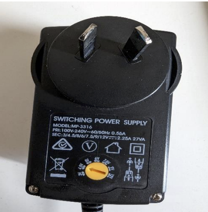

2. Take 5.5*2.1 mm jack and plug at the end with matching the arrows. 

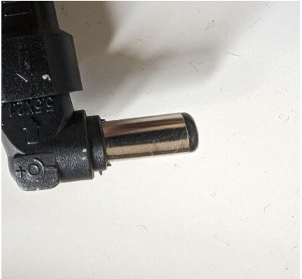

3. Wire the 2.1mm DC socket with Terminal Block. Strip the wires. Wire red wire to positive side and green wire to the ground.

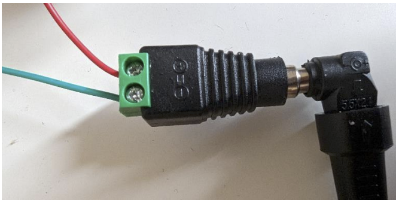

## 3. Motor Components Assembly

### a. Stepper Motor Soldering

- **Materials:** 

1. eBay Mini 5mm 2-phase 4-wire 3V 5V Planetary Gear Stepper Motor linear Screw 
Slider-(2 units) 
2. 26 AWG wire for soldering (Yellow, White, Black, Green)- 260 cm length for every 
wire-(2 units)

- **Procedure:**

1. Place the motor horizontally on table and stick the end of the motor flat onto the 
surface where soldering is to be done. 
2. Strip the wires into the length half of the size of the motor soldering plate. 
3. Now solder the wires into this order shown below: 

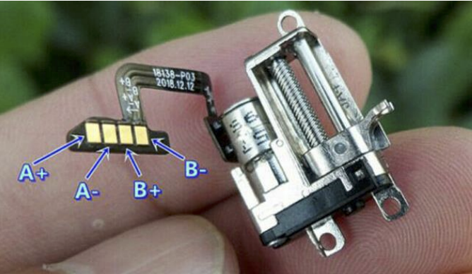

A+ to yellow wire 

A - to white wire 

B+ to black wire 

B- to green wire

4. The soldering should be done carefully as the pad of motor is very small and two ends can join up during soldering. 
5. The final soldering of the motor look like this: 

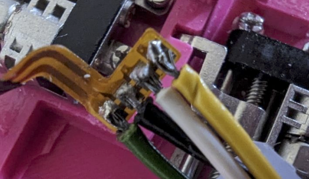

6. Similarly, solder the second motor with similar wires in similar order. 

### b. Assembling Motor into 3D Printed Faceplate

- **Materials:** 
1. Soldered two stepper motors 
2. 3D printed Assembly 
3. M1.6*4.5 threaded bolts or screws 

- **Steps:** 
1. Of the two motors, one is responsible for vertical movements and one is 
responsible for horizontal movements. 
2. The vertical movement motor is fixed upon upper three 
holes as shown in figure with its linear actuator fixed in 
the opening to its side. Take three screws and screw the 
three hinges of motor as in figure. 

3. Similarly, the horizontal movement motor is fixed in 
there holes below the motor with its actuator fixed in 
the opening. 

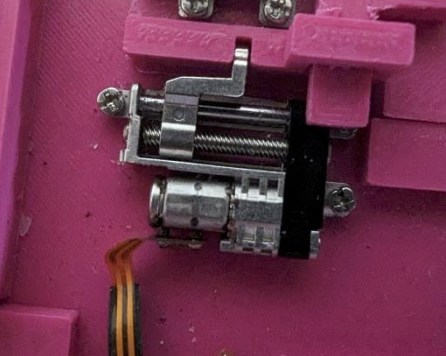

4. Now take the other end of the wires and line them up in their appropriate way and 
glue them in. There are two holes provided for the end of wires to follow along. 
The final sub-assembly look like this: 

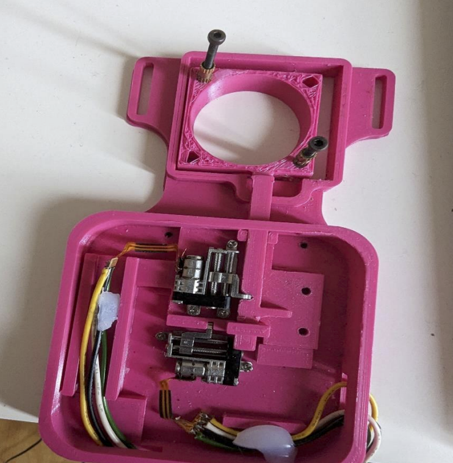

### c. Soldering and Wiring 3V Regulator

- **Materials:** 
1. 3V Buck converter set 
2. Some Arduino jumper wires female-female (orange, red and green) 

Steps: 
1. Take the buck converter set and solder the pins into place like 
this. 

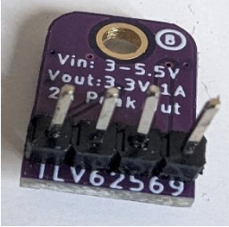

2. Now, cut the jumper wires into half and strip the end. 

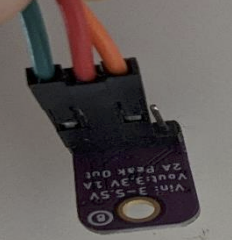

3. Now there are three pins which should be connected to jumper 
wires female like listed below: 
Vin-orange    GND-green   3V-red 

### d. Connecting Stepper Motor Drive Controller

Parts needed: 
1. Sub-assembly obtained from step b 
2. Stepper Motor Drive Controller *2 
3. Arduino female-female jumper wires (2*green, 1*yellow, 1*white, 1*black, 
1*red) *2

Steps: 
1. Strip the loose ends of wire coming from two stepper motor. 
2. Now, these wires (4 each) is connected to the stepper motor drive controller. 
3. Take all 4 wires (yellow, white, black green) from a motor with vertical 
movements and a motor drive controller green end.  
4. The yellow and white wire is wired into Motor A and 
black and green is wired into Motor B. Take reference 
of the picture: 

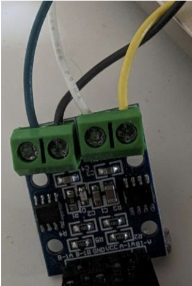

5. Similarly, wire the other motor controller drive with the 
horizontal movement motor. 

6. Now, the opposite end of motor drive controller has 
pins where female Arduino jumper wires should be 
connected. 

7. Cut the Arduino jumper wires into the half and strip the end. 

8. Now connect the female end of jumper wire to the corresponding pin as listed 
below: 

A-1B with yellow 

A-1A with white 

VCC with red 

GND with green 

B-1B with black 

B-1A with green 

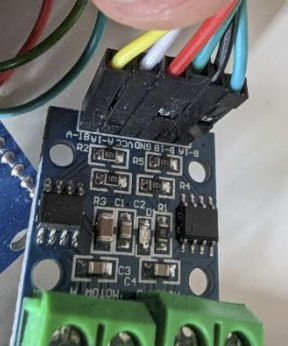

9. Similarly, follow the similar steps for another motor and this section is complete. 

## 4. Arduino with Terminal and Joystick Shield Assembly

- **Components:** 
1. Arduino Uno * 1 
2. Terminal Shield *1 
3. Joystick Shield Funduino *1 

Steps: 
1. Take Arduino Uno and on top of that place the terminal shield by aligning the digital and 
analog pins of Arduino with that of terminal shield. 
2. Now take joystick shield and place on top of the black female pins of terminal shield. 
Align the shield accordingly with the number of pins per side. 
3. The sub-assembly is complete. 

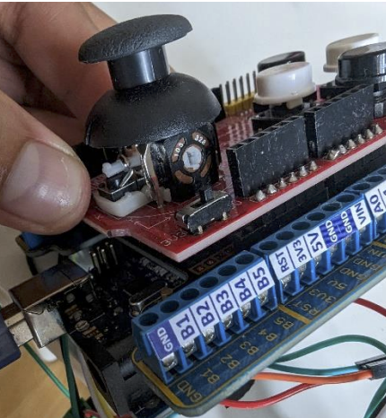

## 5. Final Wiring and Check

Parts Needed: 
1. All sub-assemblies created till now. 
2. Green 26 AWG wire of length 20 cm. 

Steps: 
1. Power terminal sub assembly with 3V regulator and Arduino: 
The end of the 2.1MM DC SOCKET WITH TERMINAL BLOCK has two green and 
red loose wires. Strip the end of these wires if needed. Screw the green wire into near 
ground terminal (GND) in Terminal shield. Connect the red wire to the orange wire of 
the 3V regulator. 

 

2. 3V regulator with motor drive controllers and Arduino. 
Take red wires of the two-motor drive controller (one each) and connect with the red 
wire of 3V regulator. These three wires must be joined together and bonded by an 
electrical tape. 
Now take Green 26 AWG wire of length 20 cm and strip both ends. Take green wires 
(GND not B-1A) of the two motor drive controller (one each) and connect with the 
green wire of 3V regulator and the one end of the Green 26 AWG wire of length 20 
cm. These four wires must be joined together and bonded by an electrical tape. Now 
take the free end of Green 26 AWG wire of length 20 cm and connect to the near 
ground terminal (GND) in Terminal shield. 

3. Motor drive controller with Arduino 
Now there are four wires (yellow, white, black and green) left in motor drive controller 
which should be connected to the respective pins in Arduino.  

|Vertical Movement Motor | Horizontal Movement Motor| 
|----------- | ----------- |
| Yellow(A2) | Yellow(D9) |
| White(A3) | White(D10) |
|Black(A4)  | Black(D11) |
|Green(A5)  |Green(D12) |
 
Connect these wires into Terminal shield and screw it accordingly. 

5. Final Check 

• Connect the power supply and both red LED from motor controller drivers should 
turn on. If not, check your connect again from Step 2 and check the wiring as grounds should be connected properly

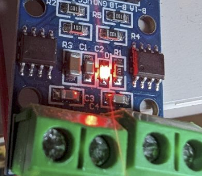

• Upload code into the Arduino and try to run with joysticks. If there is no red LED in joystick shield, check your connection in Step 3. If any problems by running the 
joystick, see the correct wires are connected to correct pins in terminal shield. 

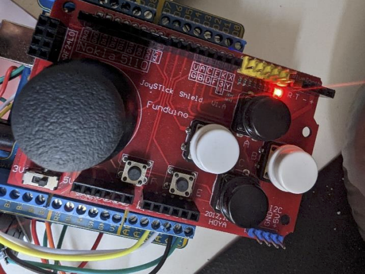

